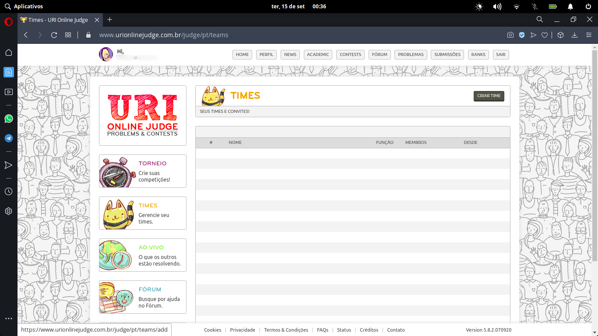
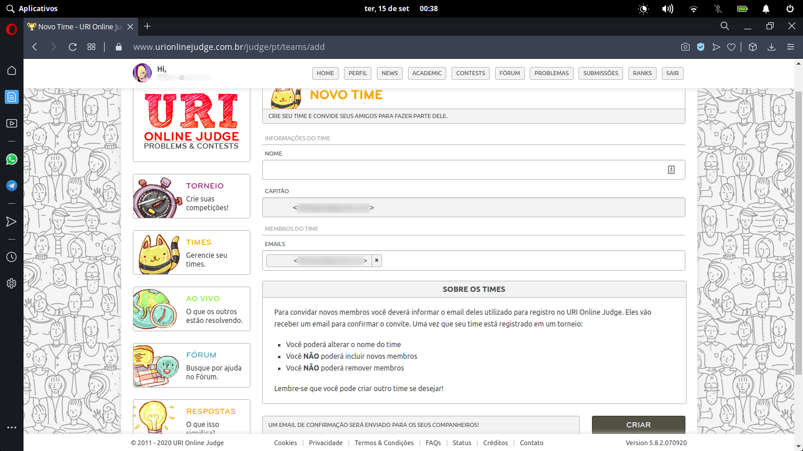
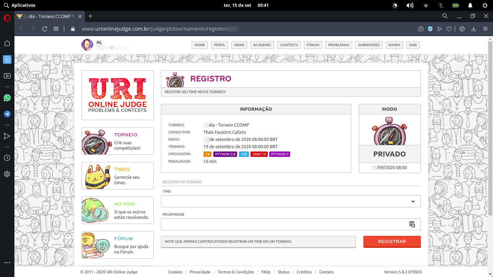
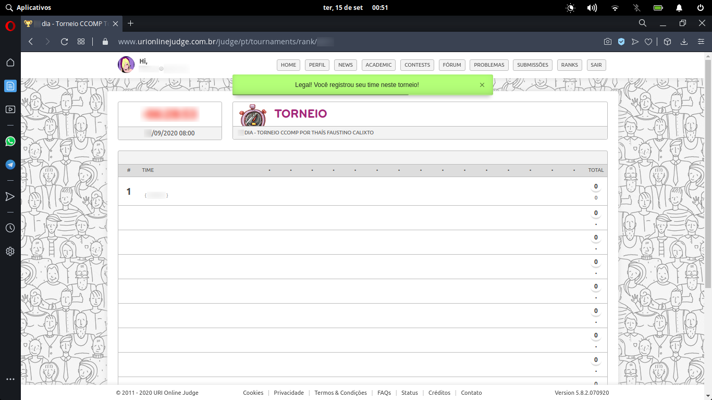

# URI

## Registro

- O uri é uma ferramenta online para obter problemas e uma correção automatizada dos mesmos. Faça seu registro no site através [deste link](https://www.urionlinejudge.com.br/judge/pt/register).
  - É preferível fazer registro utilizando seu email institucional.

- Feito o registro, é possível declarar sua universidade através das configurações do perfil.

## Entendendo o URI

- Quando sua questão for enviada ela será avaliada pelo sistema do site, e dependendo do resultado, você será informado de erros diferentes. Para entender o significado de cada um, entre [neste link](https://www.urionlinejudge.com.br/judge/pt/answers).
- Para o funcionamento adequado do sistema de correção, o URI requer uma estrutura básica em todos seus programas, que deve ser seguida. Para entender essa estrutura acesse [o link](https://www.urionlinejudge.com.br/judge/pt/faqs/about/examples) que contém um exemplo de questão resolvida em todas as linguagens suportadas pela plataforma.

## Como entrar nos torneios?

- Iremos disponibilizar links e senhas para cada dia de torneio. Aqui vai um passo-a-passo de como se inscrever:

1. Você precisa estar logado na sua conta do uri.

2. Para se inscrever você precisa ter um time registrado. este passo só precisa ser realizado uma vez.

   1. Acesse [este link](https://www.urionlinejudge.com.br/judge/pt/teams) para criar seu time.

      

   2. Ao clicar em **CRIAR TIME** você irá para a seguinte página:

      

   3. Insira um nome único para seu time e clique em **CRIAR**.
   4. Um popup aparecerá informando que o time foi criado com sucesso.

3. Acesse o link do torneio que foi divulgado e se registre.

   1. Você entrará nesta página

      

   2. Selecione o time que foi criado no passo anterior.

   3. Insira a senha e clique em **REGISTRAR**.

   4. Um popup irá informar que o registro foi um sucesso, e você irá para a página do torneio.

      

4. Quando as questões forem liberadas basta clicar no ícone delas (na imagem acima são os pontinhos à esquerda do **TOTAL** no cabeçalho da tabela) e enviar em uma das linguagens válidas para o torneio para pontuar.

## Observações pontuais

Para quem já está familiarizado com outras linguagens de programação, nosso torneio também aceitará **Java**, **C#** e **C**. E para estes temos algumas observações especiais sobre a estrutura básica que o URI requer.

### Java

- O uso de `BufferedReader` é opcional. Também é possível realizar a entrada e saída através de `Scanner`, assim não há a necessidade de implementar `IOException`.

### C#

- O URI aceita códigos que declarem o `namespace`, mas este não é obrigatório.